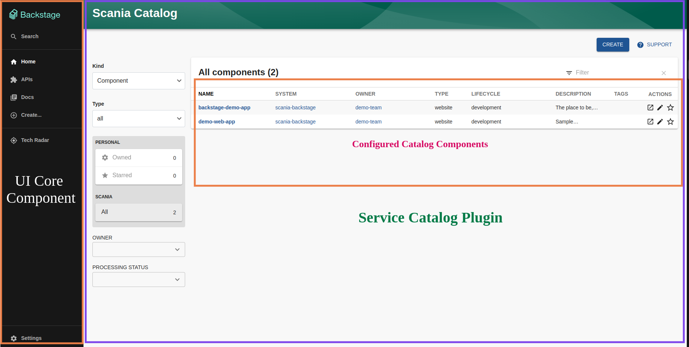

# Overview

There are 3 main components in this architecture:
1. The core Backstage UI
2. The UI plugins (and their backing services)
3. Databases

## The core Backstage UI

The core Backstage UI consists of the following components:
1. Software Catalog: The Backstage Software Catalog is a centralized system that keeps track of ownership and metadata for all the software in your ecosystem (services, websites, libraries, data pipelines, etc). The catalog is built around the concept of [metadata YAML files](https://backstage.io/docs/features/software-catalog/descriptor-format/) stored together with the code, which are then harvested and visualized in Backstage. For more information, please refer to [documentation](https://backstage.io/docs/features/software-catalog/).
2. Kubernetes: For more information, please refer to [documentation](https://backstage.io/docs/features/kubernetes/), as this is not currently implemented as part of this setup.
3. Software Templates: For more information, please refer to [documentation](https://backstage.io/docs/features/software-templates/), as this is not currently implemented as part of this setup.
4. Backstage Search: For more information, please refer to [documentation](https://backstage.io/docs/features/search/), as this is not currently implemented as part of this setup.

## The UI Plugins

Each plugin is a client-side application that mounts itself on the UI. Plugins are written in TypeScript or JavaScript. They each live in their own directory in backstage/plugins. For example, the source code for the workflow plugin for this task is available at .
To create a new FE plugin, we can use below commands,
yarn new --select plugin

